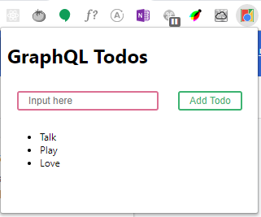

# Chrome Todo

> Deprecated refer to [Retrospection](#retrospection)

Currently not working, But you want to working app, Changed below source code.

[src/graphql/resolvers.js](src/graphql/resolvers.js)

```js
import { saveTodos, getTodos } from "../localStorage";
// import { saveTodos, getTodos } from "../chrome";
```

## Retrospection

1. I think uncomfortable using chrome.storage.sync with react
   1. Every single build when I just fixed code one line. And build speed is low.(Maybe If I adjust something that webpack. Build speed is more faster. But not now.)
   1. Must write eslint exception code or setup eslint.(Because Access chrome object is able in chrome extension.)
1. Not awesome graphql apollo in chrome extension, Because not working apollo extension in chrome extension developer tools.(I hope fix whenever)

Todo in chrome.

# Demo



# Install

```
npm i
```

# Start

http://localhost:3000/

```
npm start
```

# Build

```
npm run build
```

# Watch

Auto Build

```
npm run watch
```

# Deploy

https://developer.chrome.com/extensions/getstarted#manifest

# License

MIT
